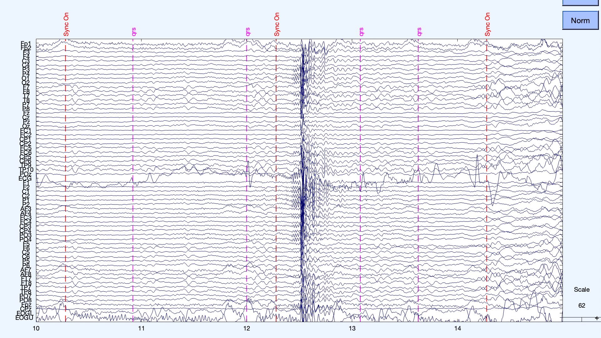
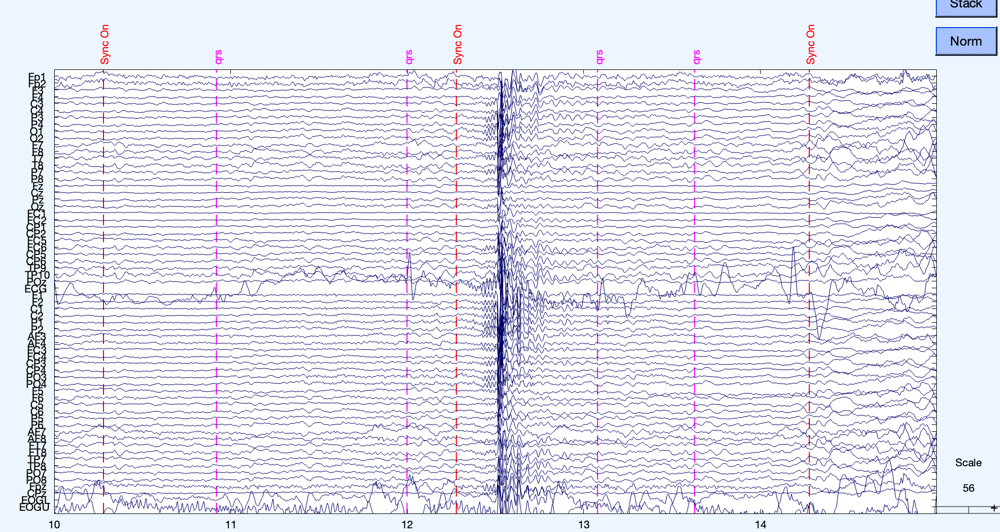

# AUX_regress_out
Function to regress out chosen Auxiliary channels from EEG data (using EEGLAB structure)

<h4> simultaneous EEG-fMRI with AUX channels ECG and EOG (after gradient artifact removal) - before EOG regressed out of EEG </h4>
   
<h4> simultaneous EEG-fMRI with AUX channels ECG and EOG (after gradient artifact removal) - after EOG regressed out of EEG </h4>
  
